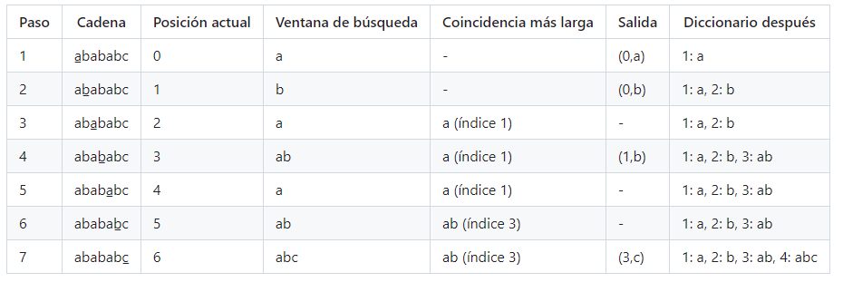

## Prompt a ChatGPT para ayuda en el código
Quiero desarrollar un algoritmo de compresión basado en el algoritmo LZW, quiero desarrollarlo en Java. El algoritmo podrá comprimir una cadena de caracteres partiendo de un diccionario que empieza vacío.

El algoritmo recorre la cadena de entrada caracter por caracter, buscando la subcadena más larga que ya esté en el diccionario.
Cuando encuentra la subcadena más larga que ya esté en el diccionario, emite el código de esa subcadena (un número que representa la entrada en el diccionario).

Luego, añade al diccionario una nueva subcadena que consiste en la subcadena encontrada más el siguiente carácter de la cadena de entrada.
A medida que el algoritmo sigue encontrando nuevas secuencias de caracteres, estas se añaden al diccionario, permitiendo comprimir más partes del texto.

Te comparto un ejemplo real de como se ve el proceso de comprimir la cadena y de como se va haciendo el diccionario:

