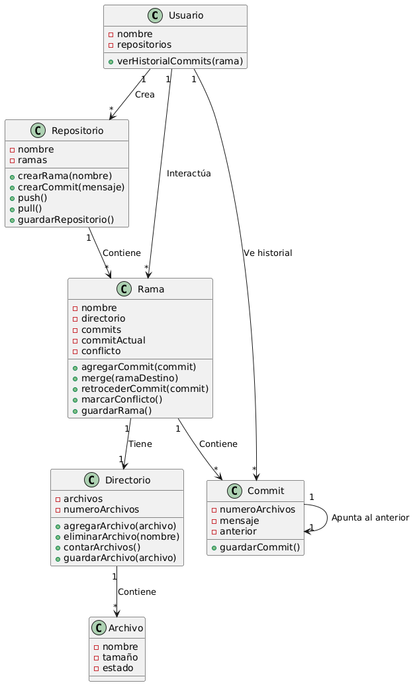
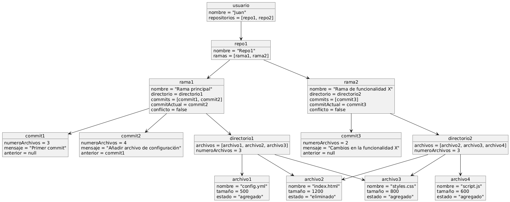

# Github: Diagrama y Árbol

Notas e instrucciones
---
Minimalista

Commit es una versión, de un punto concreto -- Estado de un directorio

Conjunto de archivos -- UNICO DIRECTORIO

Sistema de archivos que es un arbol

arbol de nombre de archivos

¿Que es un estado de un directorio? --  Cómo lo cambiamos -- Supongamos que nos vale, el numero de archivos (ALTERNATIVA, ver el peso de cada archivo)

Ramas

---

### Primera Aproximación
 

Comentario: Después de un análisis, me he dado cuenta de que he tomado una decisión incorrecta, no es un diagrama que represente de verdad lo qué es un control de versiones, es más bien un diagrama que representa los commits, y como es su flujo. Así que paso a una representación más adecuada.

### Segunda Aproximación

Para hacer está segunda aproximación me he tomado el tiempo de desglosar un poco más el sistema. Y he detallado los siguientes elementos clave:

Usuario:

    Crea y administra repositorios.

Repositorio:

    Contiene un único directorio.
    Puede tener múltiples ramas.

Rama:

    Representa una línea de desarrollo.
    Contiene una secuencia de commits.

Commit:

    Representa un punto exacto en el tiempo.
    Guarda una versión específica del directorio (archivos y su estado).

Archivo:

    Representa los elementos que existen en el directorio.
    Podría incluir atributos como nombre, tamaño o contenido (si necesitamos más detalle después).

Teniendo esto claro, me surgieron las siguientes preguntas. 

¿El commit guarda solo los nombres de los archivos o también otra información?

    Por temas de simplicidad o diseño se ha decidido que cuando un estado cambie, en un punto sean la cantidad de archivos, es decir, si tenemos un archivo, y se agrega 1, pues quiere decir que hubo un cambio y que, por lo tanto, debería haber un commit.

¿El commit guarda solo los nombres de los archivos o también otra información?

    Pues cada rama es independiente, asi que sus commits deberian serlo también

    
Cuando un usuario crea un repositorio, ¿debería empezar vacío (sin archivos ni commits)?
    
    Sí, así como se va creando un árbol, pues debería poder crearse vacío. Repositorio Vacío.

Además decidí - obviamente, cumpliendo con la simplicidad y minimalismo - cubrir los elementos básicos que decidí que se deben hacer en un repositorio:

- Creación de repositorios y ramas

- Commits y gestión de archivos

- Manejo de versiones y fusión

- Retroceso a versiones anteriores

- Historial de commits

- Gestión de conflictos

- Persistencia (Guardar en un punto exacto)

Y es por eso que llegué a este diagrama, un poco más trabajado, y hecho en PLANTUML:

Y es por eso también que para un mayor entendimiento he creado el siguiente diagrama de objetos, que me parecería innecesario explicarlo de lo claro que es:

