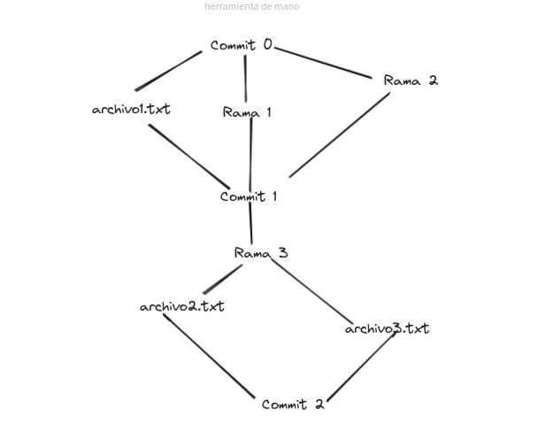

# Github: Diagrama y Árbol

Notas e instrucciones
---
Minimalista

Commit es una versión, de un punto concreto -- Estado de un directorio

Conjunto de archivos -- UNICO DIRECTORIO

Sistema de archivos que es un arbol

arbol de nombre de archivos

¿Que es un estado de un directorio? --  Cómo lo cambiamos -- Supongamos que nos vale, el numero de archivos (ALTERNATIVA, ver el peso de cada archivo)

Ramas

---

### Primera Aproximación
 

Comentario: Después de un análisis, me he dado cuenta de que he tomado una decisión incorrecta, no es un árbol, o un diagrama que represente de verdad lo qué es un control de versiones, es más bien un diagrama que representa los commits, y como es su flujo. Así que paso a una representación más adecuada.