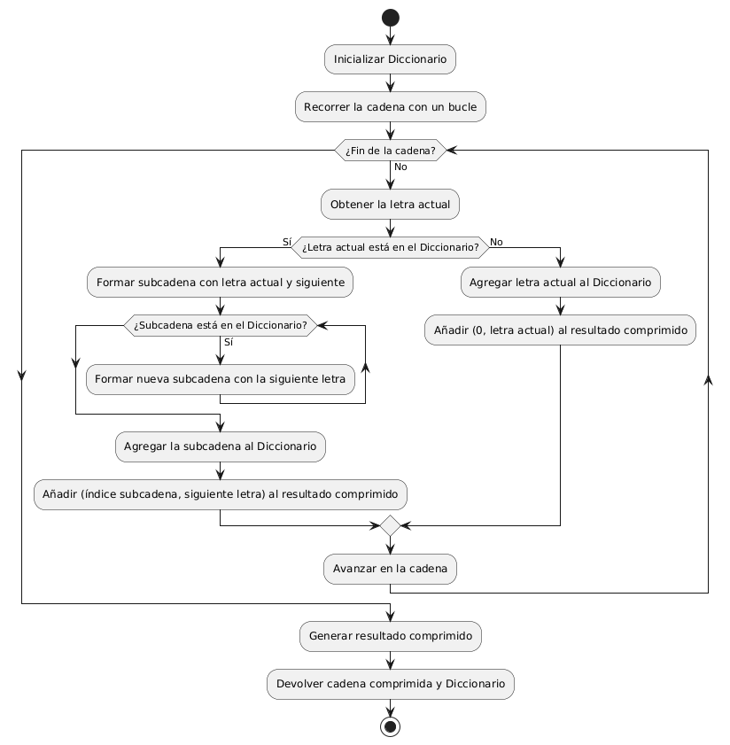

# Título del Proyecto

## Nombre del Proyecto: Compresor de cadenas.

Lo que hace este código  es el recibir una cadena del usuario, y se encarga en iterar en cada uno de los carácteres para poder generar una serie de datos en una estructura "(indice, caracter)" que corresponde al mensaje original.

## Descripción General
Propósito: Comprimir cadenas de texto.

Funcionalidades Principales: 
- El poder ingresar una cadena de texto
- El agregar elementos a un objeto **DICCIONARIO**
- Los elementos son carácteres que se van agregando
- Formar subcadenas de texto con carácteres que se repiten
- Comprimir la cadena de texto ingresada

## Requisitos del Sistema
Lenguaje de Programación: Java.

Entorno de Desarrollo: Visual Studio Code.

## Estructura de Datos

Mi compañero Ángel implementó el ejercicio usando una clase **Lista** con la cual guarda los datos dinámicamente. Su proyecto cuenta con varias clases, de las cuales solo explicaré dos ya que son las que se encargan esencialmente del problema que estamos revisando:

---

#### Clase Compresor:
Esta clase es responsable de comprimir la cadena de entrada utilizando un diccionario. Su lógica central reside en iterar sobre la cadena y comprimirla utilizando patrones que se agregan a un diccionario.

##### Métodos

###### Compresor() (Constructor)
- Descripción: Inicializa una nueva instancia de Compresor y crea un nuevo Diccionario.
- Parámetros: Ninguno.
- Retorno: Ninguno.

###### comprime(String cadena)
- Descripción: Método principal que toma una cadena de texto, la recorre y la comprime utilizando el diccionario. Retorna el resultado comprimido y el contenido del diccionario.
- Parámetros: cadena: La cadena que será comprimida.
- Retorno: Un array bidimensional String[][] que contiene dos partes:
La cadena comprimida en formato "(índice, letra)".
El contenido del diccionario que se usó durante la compresión.

---

#### Clase Diccionario
Esta clase es un contenedor que almacena las subcadenas encontradas. Ofrece funciones para agregar elementos, buscar en el diccionario y listar los elementos almacenados.

##### Métodos
###### Diccionario() (Constructor)
- Descripción: Inicializa una nueva instancia de Diccionario y crea una lista vacía donde se almacenarán las subcadenas.
- Parámetros: Ninguno.
- Retorno: Ninguno.

###### estaEnDiccionario(String subcadena)

- Descripción: Verifica si una subcadena está presente en el diccionario. Si existe, devuelve el índice donde está almacenada, y si no, devuelve -1.
- Parámetros: subcadena: La subcadena que se quiere buscar en el diccionario.
- Retorno: Un entero que indica el índice de la subcadena en el diccionario o -1 si no está.

###### agregar(String subcadena)

- Descripción: Agrega una nueva subcadena al diccionario.
- Parámetros: subcadena: La subcadena que se va a agregar al diccionario.
- Retorno: Ninguno.

###### listar()
- Descripción: Retorna el contenido actual del diccionario como un array de cadenas.
- Parámetros: Ninguno.
- Retorno: Un array String[] que contiene todas las subcadenas almacenadas en el diccionario.

## Modelo 

## Notas Personales

Es un proyecto dentro de lo simple y lo complejo, he sido capaz de entender el código en su mayoría, pero tiene algunas cosas que pues no termino de entender, o no terminan de funcionar al probarlo. Por ejemplo al ingresar una cadena ABABABCD
lo que hace al principio esta bien ya que coge el A, B, AB, ABA, BA, entonces el ABA y BA sobran, así que no reconoce cuando pasar al siguiente caracter dejando el anterior. Pero dentro de lo que cabe es un código a mi parecer bien estructurado y que cumple una función mínima. 