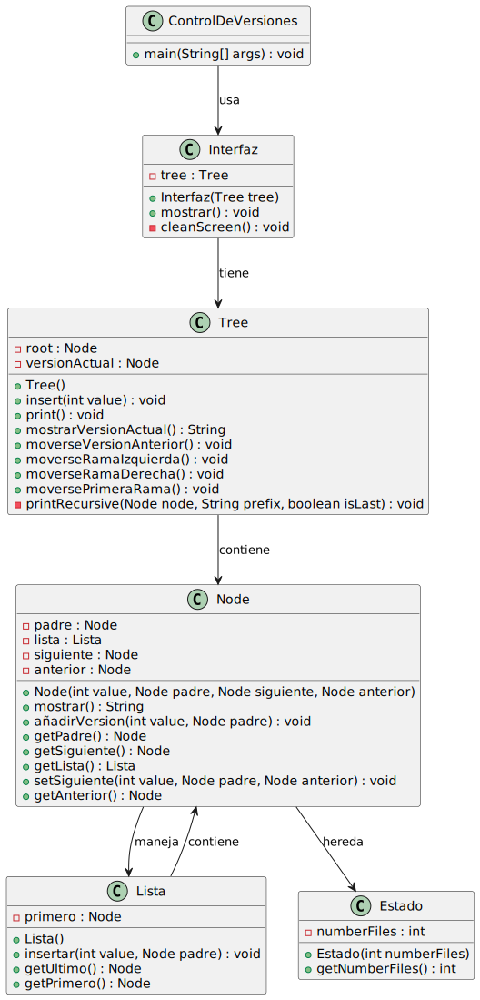

# Modelo de sistema de control de versiones

## `Reto realizado en grupo por Martín López de Novales, Fernando William y Marcos Gutiérrez.`

## Descripción detallada de la estructura de datos y su relación con un sistema de control de versiones

### Estructura General

El sistema de control de versiones implementado utiliza una **estructura de árbol** para representar y gestionar las distintas versiones creadas a lo largo del tiempo. Cada nodo del árbol corresponde a una **versión** específica, que incluye información sobre su número de archivos y sus relaciones con otras versiones (como versiones padre, hermanas o descendientes). Esta estructura refleja de manera precisa el comportamiento típico de sistemas de control de versiones modernos.

### Elementos principales de la estructura

1. **Clase `Tree` (Árbol principal):**
   - Es el núcleo de la estructura de datos y actúa como el controlador del sistema.
   - Mantiene dos referencias importantes:
     - `root`: el nodo raíz, que representa la versión inicial del sistema.
     - `versionActual`: un puntero dinámico que se actualiza para seguir la versión activa o seleccionada por el usuario.
   - Proporciona métodos para insertar nuevas versiones, navegar entre versiones (anterior, rama izquierda/derecha), moverse a una rama descendiente, y visualizar el árbol completo.

2. **Clase `Node` (Nodo del árbol):**
   - Representa cada versión individual dentro del árbol.
   - Contiene:
     - Un puntero al **padre**, que permite navegar hacia la versión anterior.
     - Punteros a versiones hermanas (**anterior** y **siguiente**), que representan ramas derivadas del mismo padre.
     - Una lista de nodos hijos (**lista**), que almacena todas las versiones derivadas directamente de esta.
   - Almacena la información asociada a la versión (como el número de archivos) heredando de la clase `Estado`.

3. **Clase `Lista`:**
   - Es una lista doblemente enlazada que organiza los nodos hijos de un nodo dado.
   - Facilita la gestión y navegación de las ramas descendientes de una versión.

4. **Clase `Estado`:**
   - Es la base de datos de cada nodo, y encapsula la información de una versión específica, en este caso tan solo nos hemos centrado en el número de archivos.

### Ventajas de esta estructura

1. **Flexibilidad:** Permite tanto control lineal como ramificado, adecuado para la colaboración en proyectos.
2. **Facilidad de navegación:** Los punteros entre nodos permiten moverse eficientemente por las versiones.
3. **Extensibilidad:** Nuevas operaciones (como fusiones o bifurcaciones avanzadas) pueden implementarse extendiendo las relaciones entre nodos.
4. **Eficiencia:** La lista doblemente enlazada para nodos descendientes minimiza el costo de insertar nuevas ramas o recorrer versiones.

[Código](reto-005a)

<a href="reto-005a/Diagramas/">Diagramas</a> 

### Control De Versiones

| Método / Atributo         | Modificador       | Descripción                          |
|----------------------------|-------------------|--------------------------------------|
| `main(String[] args)`      | `public static`   | Método principal del programa.       |

---

### Estado

| Método / Atributo          | Modificador       | Descripción                                |
|-----------------------------|-------------------|--------------------------------------------|
| `getNumberFiles()`          | `public`          | Devuelve el número de archivos de la versión. |
| `numberFiles`               | `private`         | Número de archivos en esta versión.        |

---

### Interfaz

| Método / Atributo          | Modificador       | Descripción                        |
|-----------------------------|-------------------|------------------------------------|
| `mostrar()`                 | `public`          | Inicia la interfaz del sistema.    |
| `tree`                      | `private`         | Árbol que almacena las versiones. |
| `cleanScreen()`             | `private`         | Método auxiliar que limpia la consola.                 |

---

### Tree

| Método / Atributo              | Modificador       | Descripción                                           |
|--------------------------------|-------------------|-------------------------------------------------------|
| `insert(int value)`            | `public`          | Inserta una nueva versión en el árbol.               |
| `print()`                      | `public`          | Imprime el árbol de versiones.                       |
| `mostrarVersionActual()`       | `public`          | Devuelve información sobre la versión actual.        |
| `moverseVersionAnterior()`     | `public`          | Mueve a la versión anterior en el árbol.             |
| `moverseRamaIzquierda()`       | `public`          | Cambia a la rama izquierda de la versión actual.     |
| `moverseRamaDerecha()`         | `public`          | Cambia a la rama derecha de la versión actual.       |
| `moversePrimeraRama()`         | `public`          | Cambia a la primera rama de la versión actual.       |
| `printRecursive(...)`          | `private`         | Imprime recursivamente el árbol.                     |
| `root`                         | `private`         | Nodo raíz del árbol.                                 |
| `versionActual`                | `private`         | Un puntero dinámico que se actualiza para seguir la versión activa o seleccionada por el usuario.               |

---

### Lista

| Método / Atributo          | Modificador       | Descripción                                  |
|-----------------------------|-------------------|----------------------------------------------|
| `insertar(...)`             | `public`          | Inserta un nodo en la lista de versiones.    |
| `getUltimo()`               | `public`          | Obtiene el último nodo de la lista.          |
| `getPrimero()`              | `public`          | Obtiene el primer nodo de la lista.          |
| `primero`                   | `private`         | Nodo inicial de la lista.                    |

---

### Node

| Método / Atributo              | Modificador       | Descripción                                 |
|--------------------------------|-------------------|---------------------------------------------|
| `mostrar()`                    | `public`          | Muestra información de este nodo.           |
| `añadirVersion(...)`           | `public`          | Añade una versión como hijo de este nodo.   |
| `getPadre()`                   | `public`          | Obtiene el nodo padre.                      |
| `getSiguiente()`               | `public`          | Obtiene la siguiente rama (hermana).        |
| `getLista()`                   | `public`          | Obtiene la lista de nodos hijos.            |
| `setSiguiente(...)`            | `public`          | Establece el nodo siguiente.                |
| `getAnterior()`                | `public`          | Obtiene la rama anterior (hermana).         |
| `padre`                        | `private`         | Nodo padre de esta versión.                 |
| `lista`                        | `private`         | Lista de versiones descendientes.           |
| `siguiente`                    | `private`         | Nodo siguiente (rama hermana derecha).       |
| `anterior`                     | `private`         | Nodo anterior (rama hermana izquierda).      |

