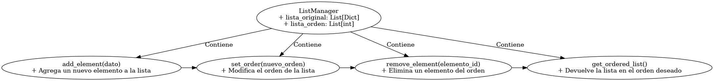

## Descripción de la Solución

La solución está dividida en dos partes principales:

1. **Lista Original**: Contiene los elementos almacenados en el orden en que fueron agregados, con un `ID` autoincremental y un `DATO`.

2. **Lista de Orden**: Contiene solo los `ID`s de la lista original en el orden en que deben ser recorridos o mostrados. Esta lista permite manejar reordenamientos sin alterar la lista original.

## Retos Resueltos

### Reto 1: El Orden

Se nos pide cambiar el orden de `A -> C -> B`, manteniendo la lista original intacta.

#### Solución
Se establece el orden A -> C -> B cambiando el índice de la lista de orden:

- **Lista Original** (inmutable):

| ID | DATO |
|----|------|
| 1  | A    |
| 2  | B    |
| 3  | C    |

- **Lista de Orden**:

| ID | DATO |
|----|------|
| 1  | A    |
| 3  | C    |
| 2  | B    |

Esto refleja el nuevo orden `A -> C -> B` sin alterar la posición física de los elementos.

---

### Reto 2: Prueba del Orden

Ahora, se nos pide cambiar el orden a `B -> C -> A`.

#### Solución
Se establece el orden B -> C -> A sin modificar los IDs ni mover los elementos físicamente:

- **Lista de Orden**:

| ID | DATO |
|----|------|
| 2  | B    |
| 3  | C    |
| 1  | A    |

La lista ahora refleja el orden `B -> C -> A`, nuevamente sin mover los elementos de su ubicación original en la lista.

---

### Reto 3: La Eliminación

Queremos "eliminar" el elemento `B`. La eliminación será solo lógica, es decir, quitaremos su `ID` de la lista de orden, pero no lo eliminaremos de la lista original.

#### Solución
Se elimina el elemento B solo de la lista de orden, dejando el orden A -> C:

- **Lista Original** (inmutable):

| ID | DATO |
|----|------|
| 1  | A    |
| 2  | B    |
| 3  | C    |

- **Lista de Orden** (sin `B`):

| ID | DATO |
|----|------|
| 1  | A    |
| 3  | C    |

El orden es ahora `A -> C`. Aunque `B` sigue existiendo en la lista original, ya no es parte del recorrido de la lista de orden.

---

### Reto 4: La Escalabilidad

Añadimos dos nuevos elementos `D` y `E` al final, y luego eliminamos `C`.

#### Solución
Se agregan D y E al final de la lista, respetando el orden A -> D -> E después de eliminar C:

1. **Lista Original** (agregamos `D` y `E`):

| ID | DATO |
|----|------|
| 1  | A    |
| 2  | B    |
| 3  | C    |
| 4  | D    |
| 5  | E    |

2. Actualizamos el orden eliminando `C`:

- **Lista de Orden**:

| ID | DATO |
|----|------|
| 1  | A    |
| 4  | D    |
| 5  | E    |

El nuevo orden es `A -> D -> E`, eliminando de manera lógica a `C`.

---

### Reto 5: La Flexibilidad

La solución permite agregar elementos al final, eliminar de manera lógica, y reordenar sin cambiar la lista original. A continuación, se muestra un resumen de las ventajas y desventajas de esta estructura.

### Diagrama UML

A continuación, se muestra el diagrama UML de la estructura:

