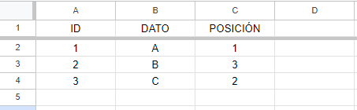
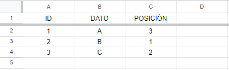
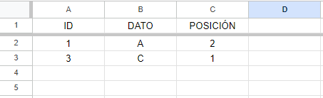
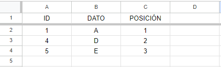
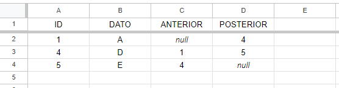

# El orden (y otras cosas) - propuesta de solución

Tenemos la siguiente información almacenada en una estructura secuencial:

|ID|DATO|
|:-:|:-:|
|1|`A`|
|2|`B`|
|3|`C`|

> [*Enlace a hoja de cálculo*](https://docs.google.com/spreadsheets/d/11sGSWUzhUCH3bWG6lcpf7bnY5raKTb67yYyY_vYtxyw/edit?usp=sharing)

Características importantes:

- En caso de aparecer nuevos elementos, siempre se agregan al final de la estructura.
- El ID es un número entero que se incrementa automáticamente para cada nuevo elemento.

## Reto 1: el orden

Supongamos que queremos establecer el siguiente orden: `A` -> `C` -> `B`.

¿Cómo modificaría y/o expandiría esta estructura para representar este orden **sin mover** los elementos existentes?

**R:** Expandimos colocando una nueva columna a la derecha llamada "Posición", cuyo fin es el de establecer un orden entre los elementos de la lista.

> 

## Reto 2: prueba de *el orden*

Con el planteamiento propuesto, establezca el orden a `B` -> `C` -> `A`.

*NOTA:* A partir de aquí, y para cada uno de los puntos siguientes, si le hace falta, adapte el planteamiento respetando las consideraciones anteriores.

**R:** En este caso, cambiamos la posición y los elementos no se mueven.

> 

## Reto 3: la eliminación

Después de resolver el reto 2, supongamos que deseamos "eliminar" el elemento `B`.

- ¿Cómo [*se*] reflejaría esta eliminación en su estructura?
- ¿Cómo quedaría reflejado el orden `A` -> `C` después de la eliminación?

**R:** Se pierde la referencia del elemento `B`, por lo que su ID se mantiene aunque su contenido no. Por esa misma razón, la posición se recorre y se actualiza, por lo que ahora se muestra a `C` en la posición "2", con su ID "3".

> 

## Reto 4: la escalabilidad

Ahora, agregamos dos nuevos elementos:

|ID|DATO|
|:-:|:-:|
|4|`D`|
|5|`E`|

Y luego, eliminamos `C`

- ¿Cómo maneja su solución la inserción de estos nuevos elementos en el orden `A` -> `D` -> `E`, respetando la regla de que físicamente siempre se agregan al final?
- Después de "eliminar" `C`, ¿cómo representaría el nuevo orden `A` -> `D` -> `E` en su estructura?

**R:** Ahora, se pierde la referencia del elemento `C`, y como se ha dicho anteriormente, su ID se mantiene aunque su contenido no. Después de que la posición sea como se nos ha indicado, los elementos nuevos tienen dicha posición asignada, por lo que ahora quedarían tal que así (como se muestra en la imagen):

|ID|DATO|POSICIÓN|
|:-:|:-:|:-:|
|1|`A`|1|
|4|`D`|2|
|5|`E`|3|

> 

## Reto 5: la flexibilidad

Reflexione sobre cómo su solución maneja la combinación de agregar nuevos elementos al final, eliminar elementos existentes y mantener un orden específico.

**R:** La asignación de ID es automática y tanto el dato como la posición pueden ser asignadas por el gestor, sin embargo, la posición se puede asignar automaticamente con respecto al anterior registro.

## 2***Think***

- ¿Qué ventajas ofrece su solución en comparación con simplemente reordenar o eliminar físicamente los elementos?

**R:** Cambiar el orden lógico es una operación de costo constante, ya que solo se actualizan referencias y no duplicamos datos, solo almacenamos referencias para el orden lógico.

- ¿Puede identificar alguna desventaja en su enfoque?

**R:** Necesitamos mantener una estructura adicional para el orden y si necesitamos buscar un elemento, podríamos requerir búsquedas en ambas estructuras.

- ¿Cómo afecta la eliminación de elementos a la eficiencia de su solución para recorrer la lista en orden?

**R:** La estructura sigue creciendo secuencialmente, y las operaciones de eliminación no afectan los datos.

- ¿Se le ocurre algún ejemplo de la vida real donde este tipo de estructura con adición secuencial, eliminación y reordenación podría ser útil?

**R:** Sistemas de gestión de colas, listas de reproducción de música y en bases de datos.

## Bonus

Piense en cómo podría modificar su solución para permitir recorrer los elementos en ambas direcciones (adelante y atrás), manteniendo las restricciones de adición al final y la posibilidad de eliminación.

**R:** Se recorre mediante la asignación y apuntar a la referencia anterior y posterior de los elementos que conforman la lista de datos, incluso manteniendo las restricciones dadas.

> 