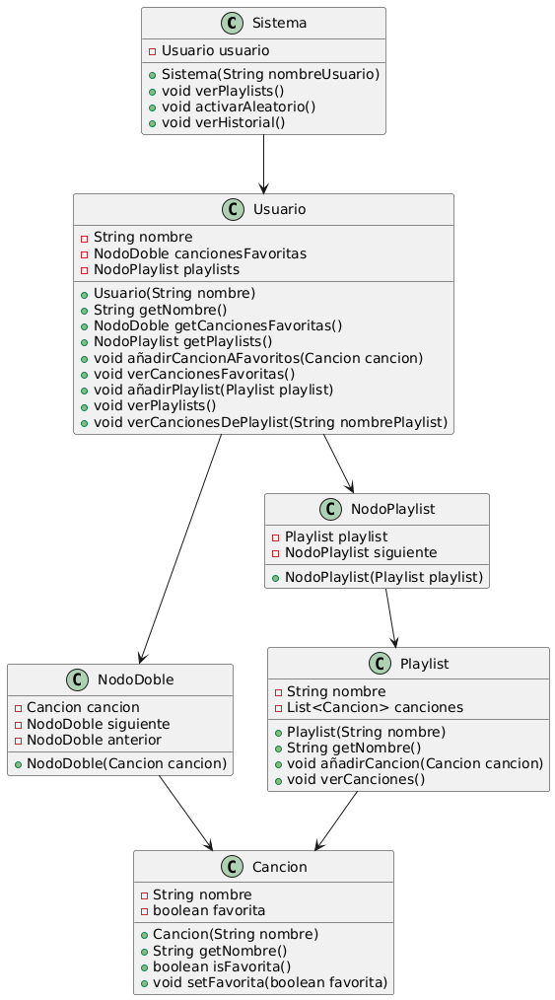

# Reto 004 - Sistema de Gestión de Música

## Clases y Métodos

### Sistema

- **Sistema(String nombreUsuario)**: Constructor que inicializa el sistema con un usuario.
- **void verPlaylists()**: Muestra las playlists del usuario.
- **void activarAleatorio()**: Activa o desactiva el modo aleatorio.
- **void verHistorial()**: Muestra el historial de reproducción.

### Usuario

- **Usuario(String nombre)**: Constructor que inicializa el usuario con un nombre.
- **String getNombre()**: Devuelve el nombre del usuario.
- **NodoDoble getCancionesFavoritas()**: Devuelve la lista de canciones favoritas.
- **NodoPlaylist getPlaylists()**: Devuelve la lista de playlists.
- **void añadirCancionAFavoritos(Cancion cancion)**: Añade una canción a la lista de favoritas.
- **void verCancionesFavoritas()**: Muestra las canciones favoritas del usuario.
- **void añadirPlaylist(Playlist playlist)**: Añade una playlist a la lista de playlists.
- **void verPlaylists()**: Muestra las playlists del usuario.
- **void verCancionesDePlaylist(String nombrePlaylist)**: Muestra las canciones de una playlist específica.

### NodoDoble

- **NodoDoble(Cancion cancion)**: Constructor que inicializa el nodo con una canción.

### NodoPlaylist

- **NodoPlaylist(Playlist playlist)**: Constructor que inicializa el nodo con una playlist.

### Cancion

- **Cancion(String nombre)**: Constructor que inicializa la canción con un nombre.
- **String getNombre()**: Devuelve el nombre de la canción.
- **boolean isFavorita()**: Devuelve si la canción es favorita.

---

> **Authors**: Ian Saucedo y Jose Pablo Morales
