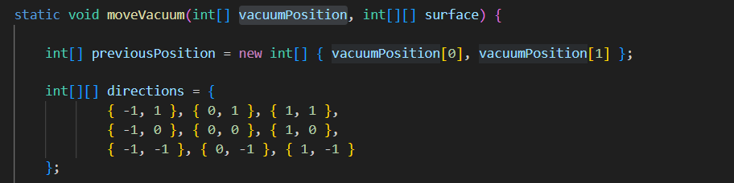
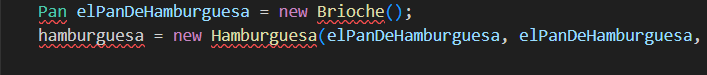

## Buen Uso vs Mal uso 

En la función `moveVacuum`, es un claro ejemplo de buen uso, debido a que aunque la aspiradora empiece en las coordenadas 0,0, al moverse requerirá una nueva posición. Mejora el código creando así una nueva referencia, de la nueva posión de la aspiradora.

Un mal uso es cuando reemplazamos el pan de abajo y el pan arriba, por uno solo haciendo que el cocinero coloque excatmente el mismo pan en las hamburguesas.
