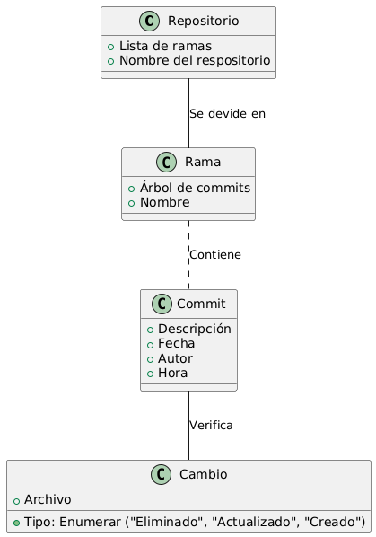

# Modelo del Dominio

Este documento describe los objetos principales de nuestro dominio, que incluyen: Repositorio, rama, commit, cambio.

Se divide en varios componentes, cada uno presentando un aspecto diferente del modelo de dominio.

## Índice
1. [Diagrama de Clases](#diagrama-de-clases)
2. [Diagrama de Objetos](#diagrama-de-objetos)

## Diagrama de Clases

- [Código PUML](./git.plantuml)

-----

## Diagrama de Objetos

| Descripción | Diagrama | Enlace PUML |
| :---: | :---: | :---: |
| Control de versiones |  | [Código PUML](./git1.plantuml) |

----

